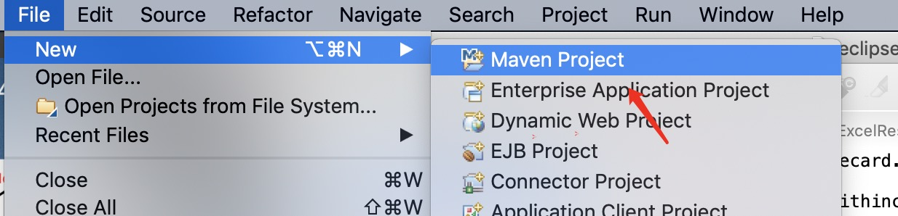
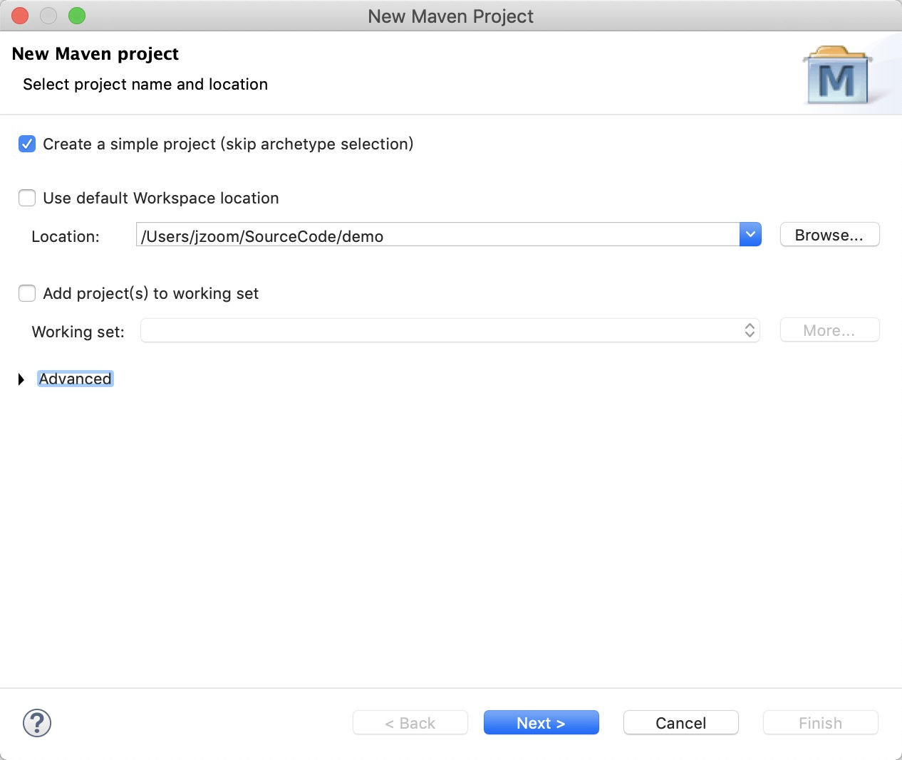
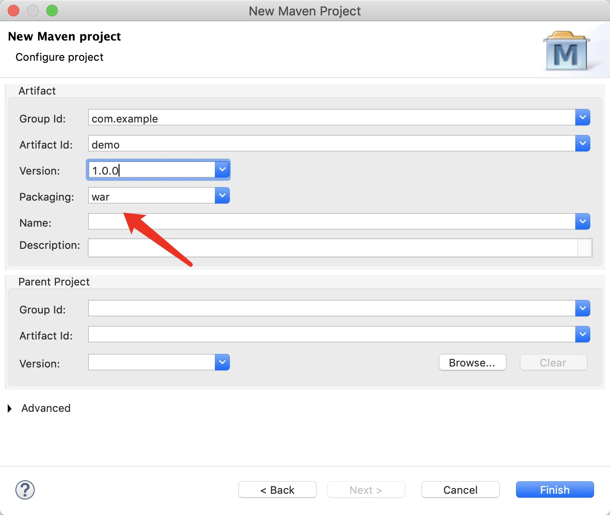
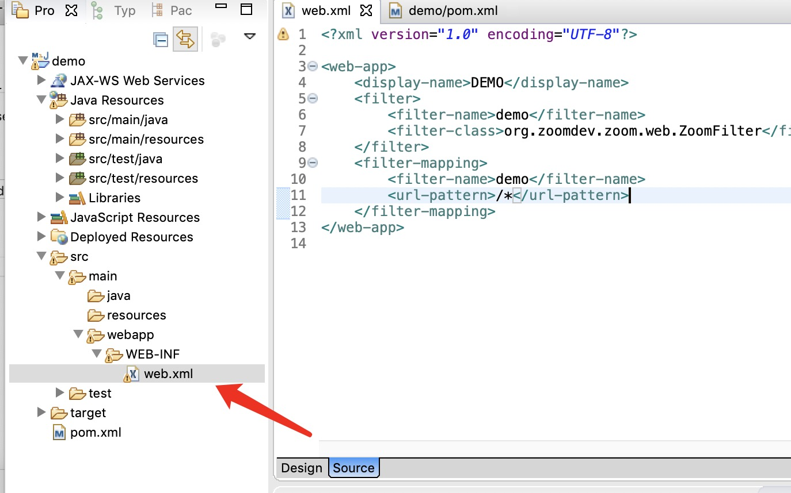
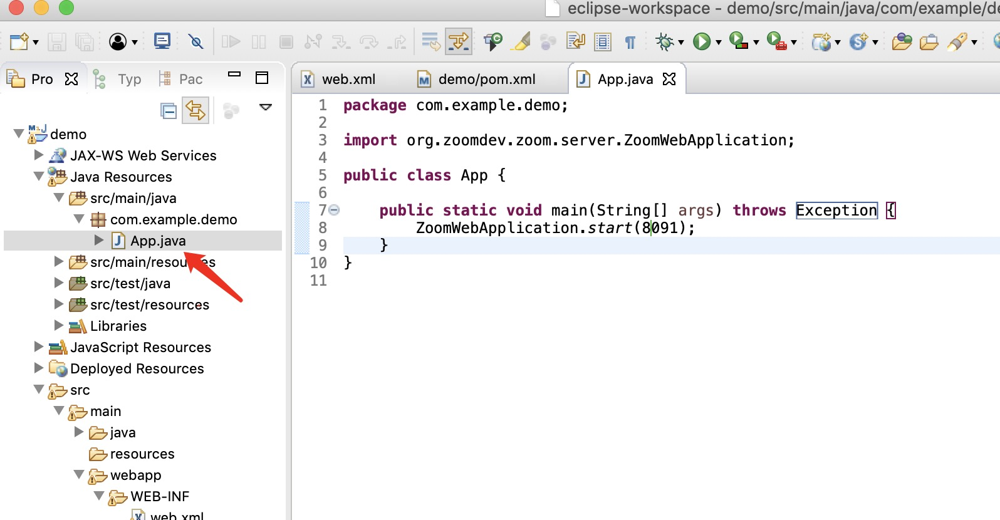
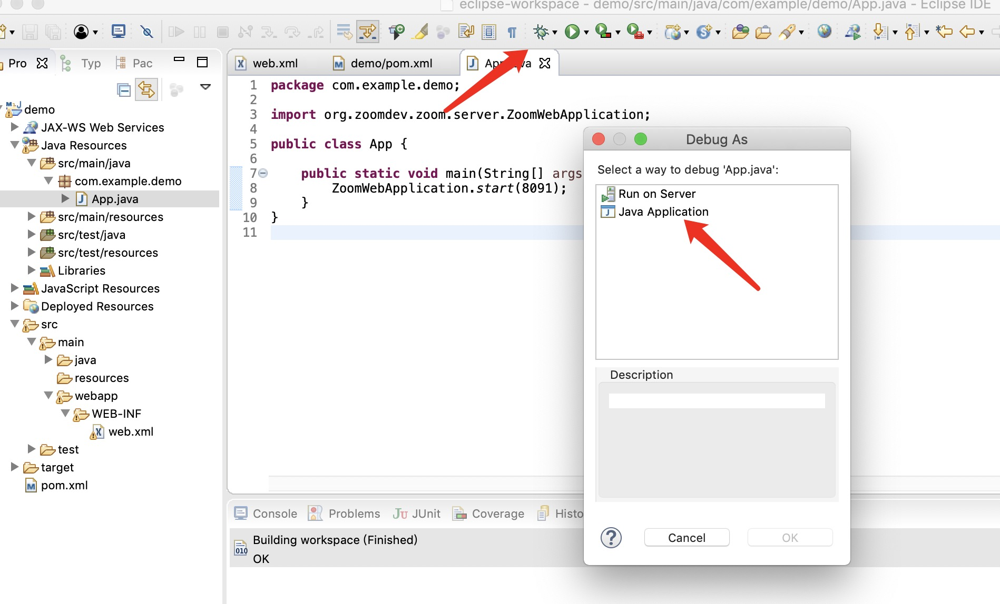
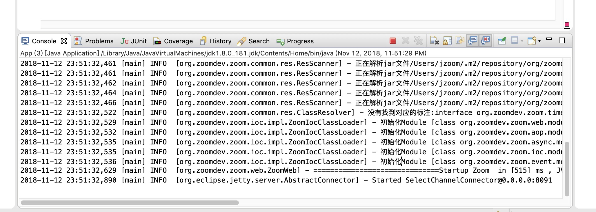
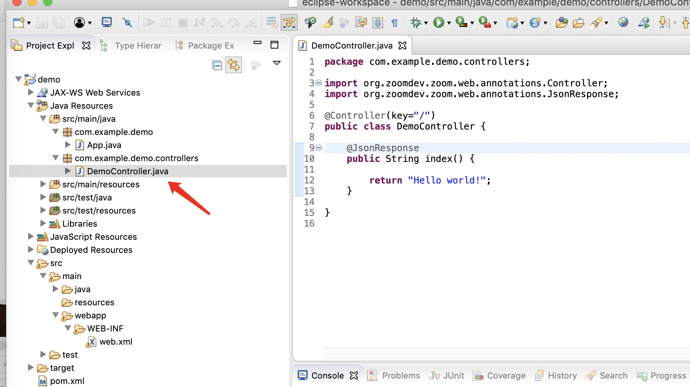

# zoom-web-demo

# 开始


## 环境要求

+ maven 3.x以上
+ jdk 1.6 或以上
+ 打开命令行能直接运行mvn

## 使用idea创建web项目

1、新建一个idea项目


2、选择项目类型maven->webapp


3、输入GroupId和Artifactid


4、这个界面默认


5、选择目录


6、编辑pom.xml新增依赖


```
<dependency>
    <groupId>org.zoomdev.zoom</groupId>
    <artifactId>zoom-parent</artifactId>
    <type>pom</type>
    <version>0.2.0</version>
</dependency>
<dependency>
    <groupId>org.zoomdev.plugins</groupId>
    <artifactId>zoom-server</artifactId>
    <version>0.2.0</version>
</dependency>
```

增加版本库的地址

```

<repositories>
    <repository>
        <id>nexus</id>
        <name>Team Nexus Repository</name>
        <url>http://nexus.zoom-dev.org/repository/maven-public/</url>
    </repository>
</repositories>
<pluginRepositories>
    <pluginRepository>
        <id>nexus</id>
        <name>Team Nexus Repository</name>
        <url>http://nexus.zoom-dev.org/repository/maven-public/</url>
    </pluginRepository>
</pluginRepositories>
```

7、创建完毕之后在src/main创建一个java的文件夹


8、编写app代码


```
package com.example.demo;

import org.zoomdev.zoom.server.ZoomWebApplication;

public class App {

    public static void main(String[] args) throws Exception {
        ZoomWebApplication.start(8091);
    }
}

```


9、增加web.xml的Filter配置


```
<?xml version="1.0" encoding="UTF-8"?>

<web-app>
    <display-name>DEMO</display-name>
    <filter>
        <filter-name>demo</filter-name>
        <filter-class>org.zoomdev.zoom.web.ZoomFilter</filter-class>
    </filter>
    <filter-mapping>
        <filter-name>demo</filter-name>
        <url-pattern>/*</url-pattern>
    </filter-mapping>
</web-app>


```

10、创建一个运行配置


选择刚才的App


11、将项目修改为Eclipse编译方式

如果不修改的话也行，但是编写Controller的参数会稍显麻烦。


12、运行项目


13、修改项目配置为自动刷新


如图勾选


看下Registry的Keymap，并使用这个快捷键调出Registry对话框，没有快捷键的话就新建个快捷键。


如图勾选


__重启下idea__，就可以自动编译了


## 使用eclipse创建项目

1、新建项目



2、如图选择 Create a simple project



3、填写程序信息



注意Package选择war

4、新建文件夹 WEB-INF,并创建web.xml，内容如下

```
<?xml version="1.0" encoding="UTF-8"?>

<web-app>
    <display-name>DEMO</display-name>
    <filter>
        <filter-name>demo</filter-name>
        <filter-class>org.zoomdev.zoom.web.ZoomFilter</filter-class>
    </filter>
    <filter-mapping>
        <filter-name>demo</filter-name>
        <url-pattern>/*</url-pattern>
    </filter-mapping>
</web-app>

```


5、pom依赖

```
<project xmlns="http://maven.apache.org/POM/4.0.0"
	xmlns:xsi="http://www.w3.org/2001/XMLSchema-instance"
	xsi:schemaLocation="http://maven.apache.org/POM/4.0.0 http://maven.apache.org/xsd/maven-4.0.0.xsd">
	<modelVersion>4.0.0</modelVersion>
	<groupId>com.example</groupId>
	<artifactId>demo</artifactId>
	<version>1.0.0</version>
	<packaging>war</packaging>


	<repositories>
		<repository>
			<id>nexus</id>
			<name>Team Nexus Repository</name>
			<url>http://nexus.zoom-dev.org/repository/maven-public/</url>
		</repository>
	</repositories>
	<pluginRepositories>
		<pluginRepository>
			<id>nexus</id>
			<name>Team Nexus Repository</name>
			<url>http://nexus.zoom-dev.org/repository/maven-public/</url>
		</pluginRepository>
	</pluginRepositories>

	<dependencies>
		<dependency>
			<groupId>junit</groupId>
			<artifactId>junit</artifactId>
			<version>4.11</version>
			<scope>test</scope>
		</dependency>
		<dependency>
			<groupId>org.zoomdev.zoom</groupId>
			<artifactId>zoom-parent</artifactId>
			<type>pom</type>
			<version>0.2.1-SNAPSHOT</version>
		</dependency>
		<dependency>
			<groupId>org.zoomdev.plugins</groupId>
			<artifactId>zoom-server</artifactId>
			<version>0.2.1-SNAPSHOT</version>
		</dependency>
	</dependencies>

</project>
```

6、编写程序



```
package com.example.demo;

import org.zoomdev.zoom.server.ZoomWebApplication;

public class App {

	public static void main(String[] args) throws Exception {
		ZoomWebApplication.start(8091);
	}
}

```

7、运行




选择Java Application




# Hello world

1、新建DemoController,注意包名必须为controllers,`Zoom` 约定Controller必须放在controllers目录



```java
package com.example.demo.controllers;

import org.zoomdev.zoom.web.annotations.Controller;
import org.zoomdev.zoom.web.annotations.JsonResponse;
import org.zoomdev.zoom.web.annotations.Mapping;

@Controller(key="/")
public class DemoController {

	@Mapping("")
	@JsonResponse
	public String index() {
		
		return "Hello world!";
	}
	
}


```

在这段程序里面，`@Controller`标注表示这个类是一个Controller。

key属性表示的是Controller的Base Url，在默认情况下Controller中的每一个public的非静态方法都将被解析为一个url。计算方法为 key / 方法名称。

`@Mapping`这个标注将改变默认的计算方法，所以增加这个标注之后，url为 key / Mapping.value()。

`@JsonResponse`这个标注表示，本方法返回的数据将被解析成为json字符串。


打开浏览器,输入网址: http://localhost:8091/


# 打包war

进入项目根目录
```
mvn clean install
```