# zoom-web-demo


# 使用idea创建web项目

1、新建一个idea项目

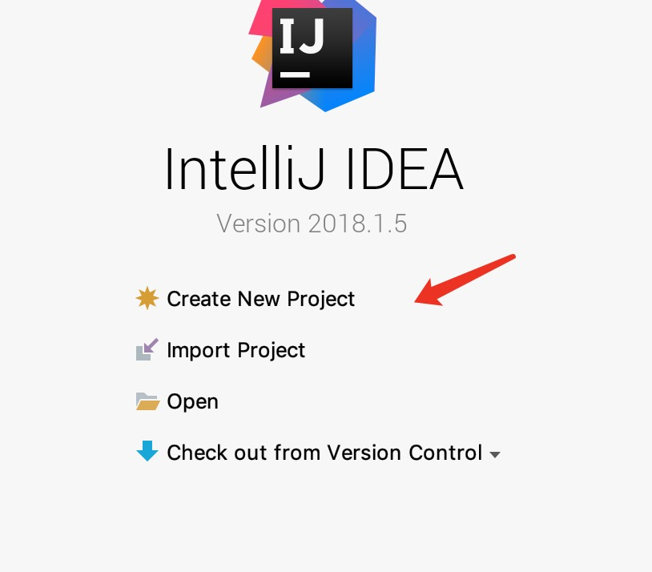

2、选择项目类型maven->webapp

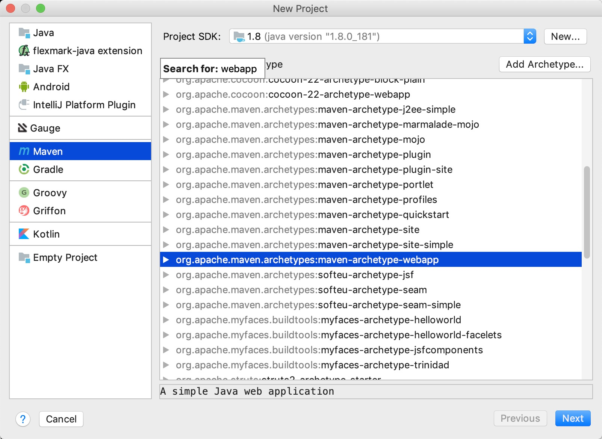

3、输入GroupId和Artifactid

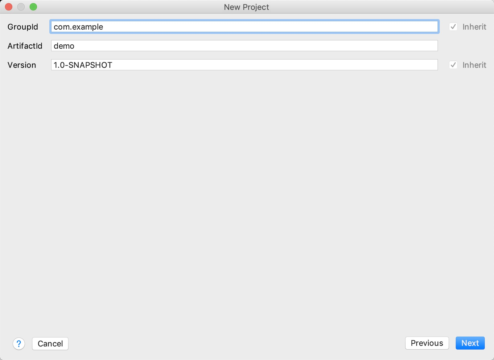

4、这个界面默认

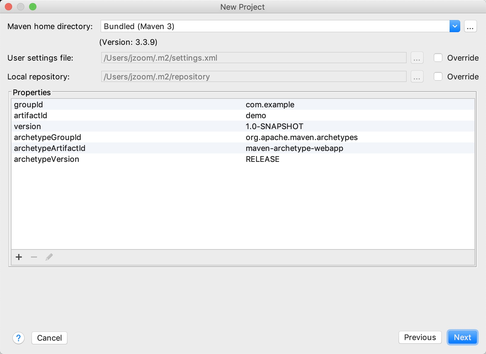

5、选择目录


6、编辑pom.xml新增依赖

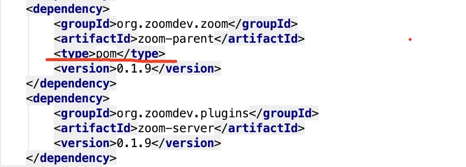

```
<dependency>
    <groupId>org.zoomdev.zoom</groupId>
    <artifactId>zoom-parent</artifactId>
    <type>pom</type>
    <version>0.2.0</version>
</dependency>
<dependency>
    <groupId>org.zoomdev.plugins</groupId>
    <artifactId>zoom-server</artifactId>
    <version>0.2.0</version>
</dependency>
```

7、创建完毕之后在src/main创建一个java的文件夹

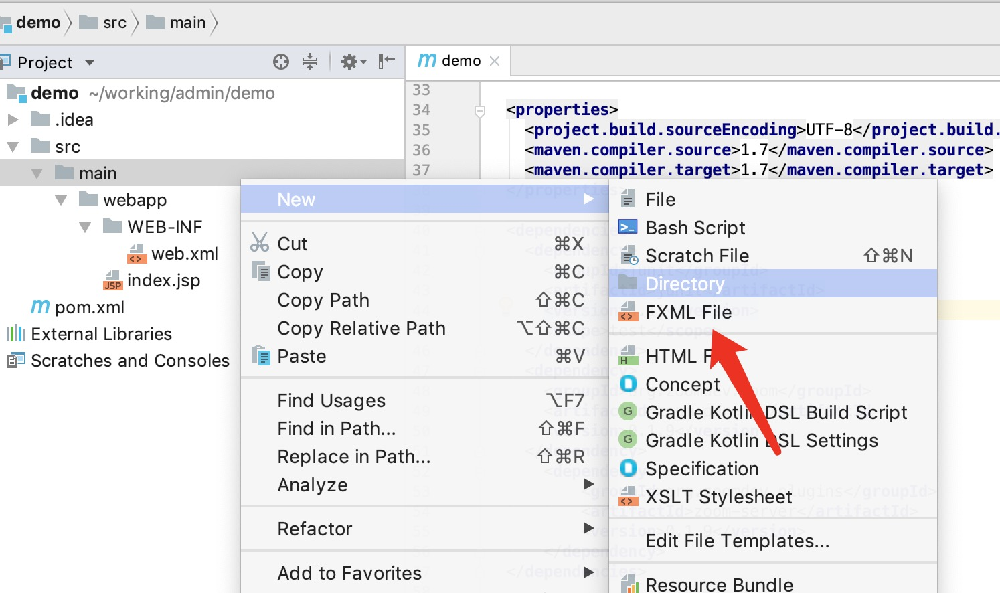

8、编写app代码

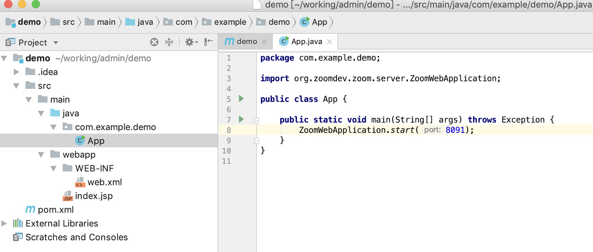

```
package com.example.demo;

import org.zoomdev.zoom.server.ZoomWebApplication;

public class App {

    public static void main(String[] args) throws Exception {
        ZoomWebApplication.start(8091);
    }
}

```


9、增加web.xml的Filter配置

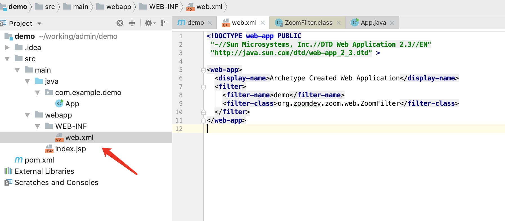

```
<?xml version="1.0" encoding="UTF-8"?>

<web-app>
  <display-name>DEMO</display-name>
  <filter>
    <filter-name>demo</filter-name>
    <filter-class>org.zoomdev.zoom.web.ZoomFilter</filter-class>
  </filter>
</web-app>


```

10、创建一个运行配置

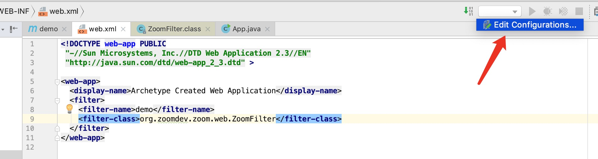


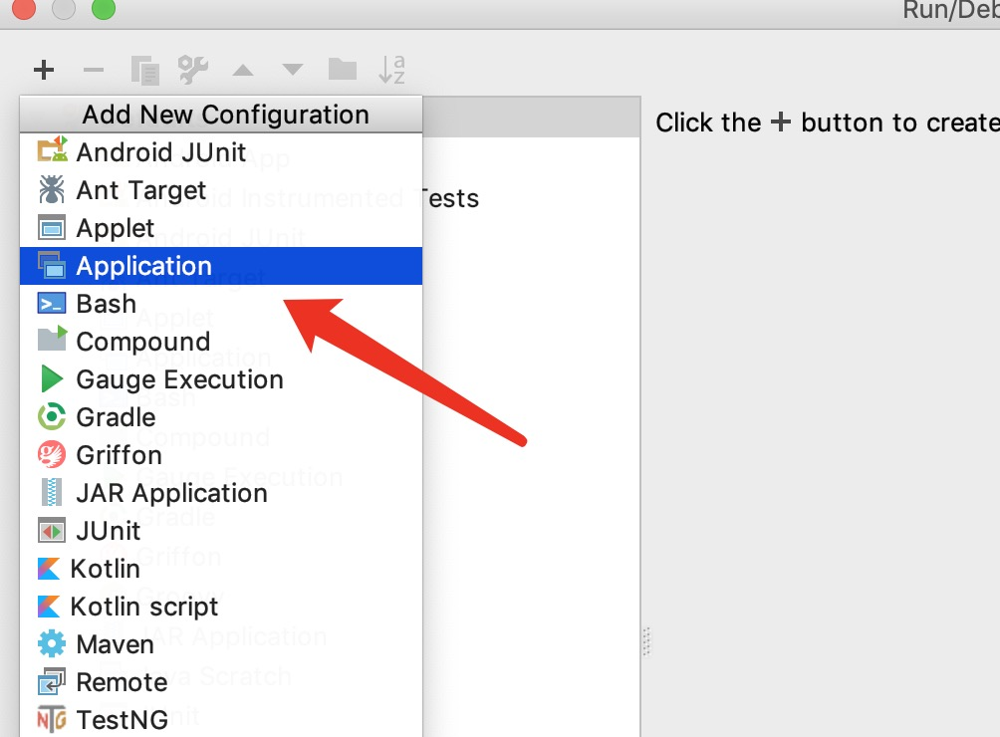


选择刚才的App

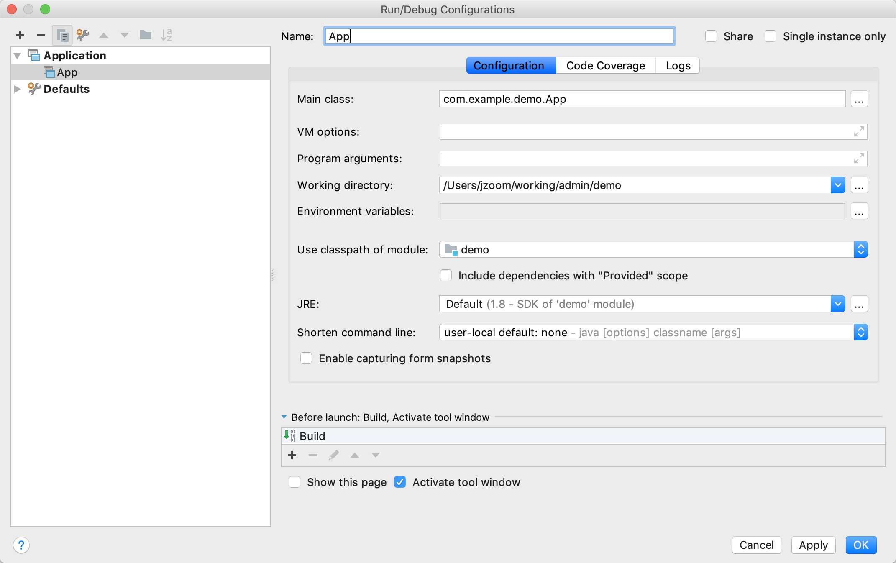

11、将项目修改为Eclipse编译方式

如果不修改的话也行，但是编写Controller的参数会稍显麻烦。

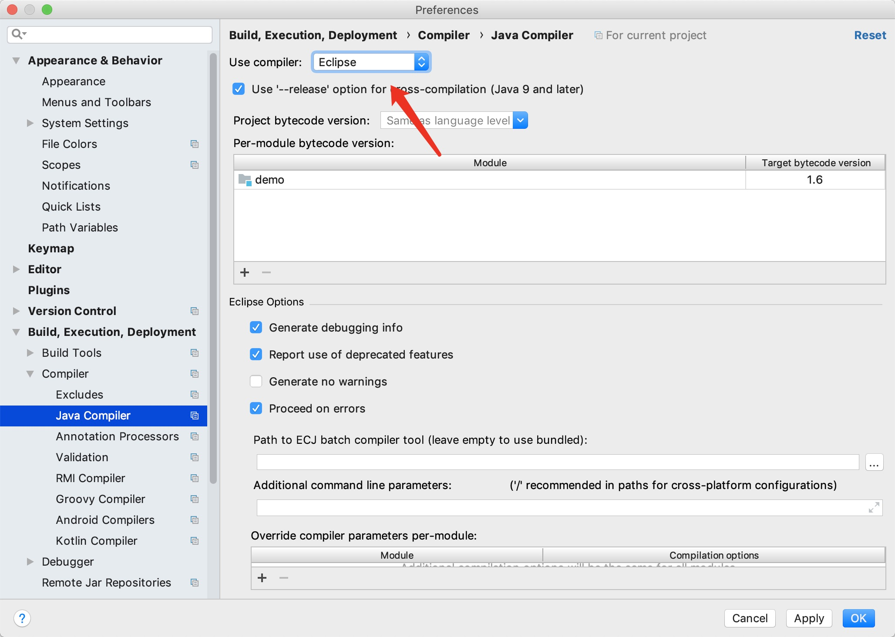

12、运行项目

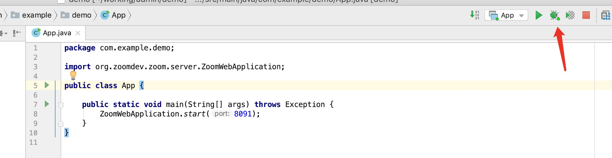

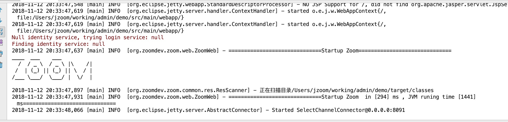