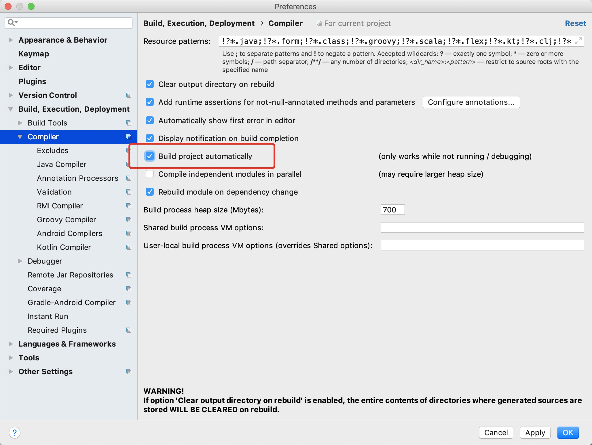
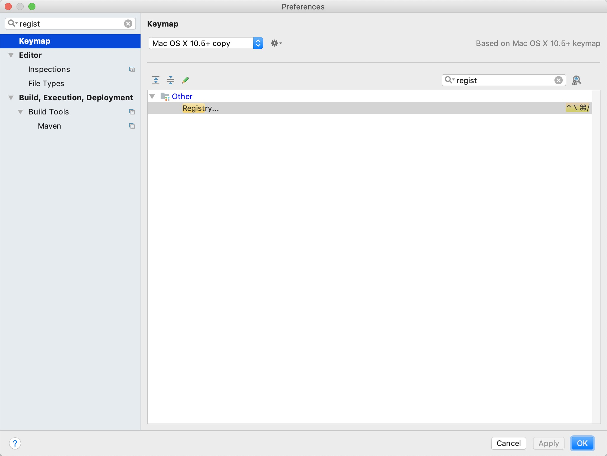
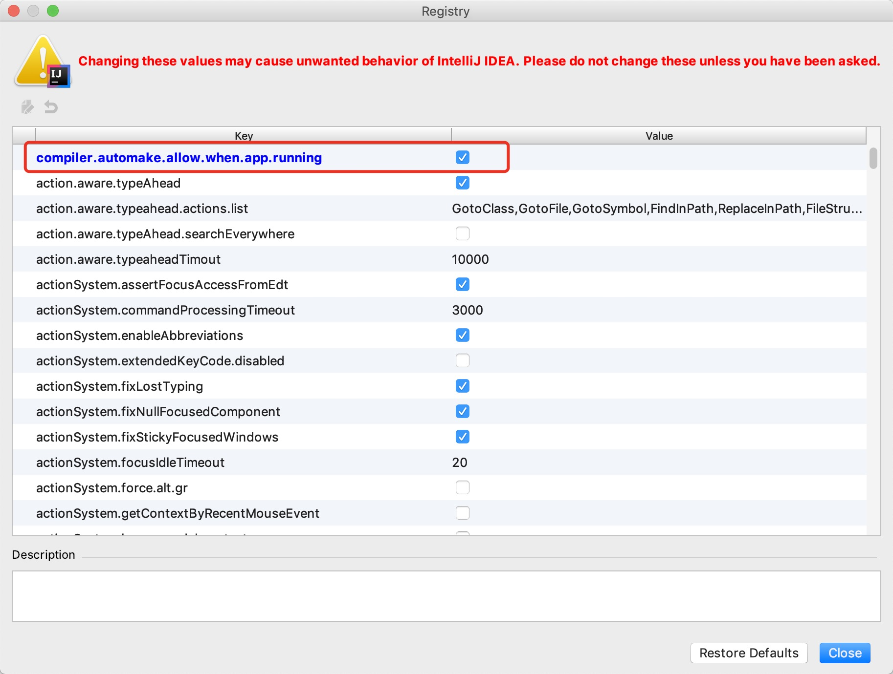
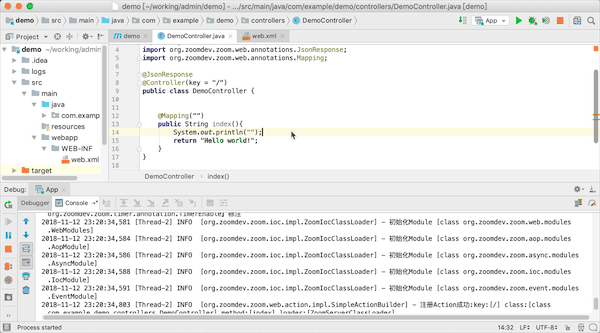

# zoom-web-demo

# 开始


## 环境要求

+ maven 3.x以上
+ jdk 1.6 或以上
+ 打开命令行能直接运行mvn

## 使用idea创建web项目

1、新建一个idea项目


2、选择项目类型maven->webapp


3、输入GroupId和Artifactid


4、这个界面默认


5、选择目录


6、编辑pom.xml新增依赖


```
<dependency>
    <groupId>org.zoomdev.zoom</groupId>
    <artifactId>zoom-parent</artifactId>
    <type>pom</type>
    <version>0.2.0</version>
</dependency>
<dependency>
    <groupId>org.zoomdev.plugins</groupId>
    <artifactId>zoom-server</artifactId>
    <version>0.2.0</version>
</dependency>
```

增加版本库的地址

```

<repositories>
    <repository>
        <id>nexus</id>
        <name>Team Nexus Repository</name>
        <url>http://nexus.zoom-dev.org/repository/maven-public/</url>
    </repository>
</repositories>
<pluginRepositories>
    <pluginRepository>
        <id>nexus</id>
        <name>Team Nexus Repository</name>
        <url>http://nexus.zoom-dev.org/repository/maven-public/</url>
    </pluginRepository>
</pluginRepositories>
```

7、创建完毕之后在src/main创建一个java的文件夹


8、编写app代码


```
package com.example.demo;

import org.zoomdev.zoom.server.ZoomWebApplication;

public class App {

    public static void main(String[] args) throws Exception {
        ZoomWebApplication.start(8091);
    }
}

```


9、增加web.xml的Filter配置


```
<?xml version="1.0" encoding="UTF-8"?>

<web-app>
    <display-name>DEMO</display-name>
    <filter>
        <filter-name>demo</filter-name>
        <filter-class>org.zoomdev.zoom.web.ZoomFilter</filter-class>
    </filter>
    <filter-mapping>
        <filter-name>demo</filter-name>
        <url-pattern>/*</url-pattern>
    </filter-mapping>
</web-app>


```

10、创建一个运行配置


选择刚才的App


11、将项目修改为Eclipse编译方式

如果不修改的话也行，但是编写Controller的参数会稍显麻烦。


12、运行项目


13、修改项目配置为自动刷新



如图勾选



看下Registry的Keymap，并使用这个快捷键调出Registry对话框，没有快捷键的话就新建个快捷键。



如图勾选


__重启下idea__，就可以自动编译了




## 使用eclipse创建项目


# 打包war

进入项目根目录
```
mvn clean install
```